<!--
  Shaun Hoffmann — GitHub Profile README
  Repo must be named exactly: shoffmann2005  (same as your username)
  Files expected at: assets/dark.svg  and  assets/light.svg
-->

<p align="center">
  <picture>
    <source media="(prefers-color-scheme: dark)" srcset="./assets/sky-blue-dark.svg">
    <source media="(prefers-color-scheme: light)" srcset="./assets/sky-blue-light.svg">
    
  </picture>
</p>

---

<!-- ╔══════════════════════════════════════════════════════════════╗ -->
<!-- ║                    SHAUN HOFFMANN · README                   ║ -->
<!-- ╚══════════════════════════════════════════════════════════════╝ -->
 
<div align="center">

<a href="https://github.com/ShaunHoffmann">
  
</a>
<br/>


<br/><br/>
 
<a href="https://shaunhoffmann.github.io">
  
</a>
<a href="https://www.linkedin.com/in/shaunhoffmann">
  
</a>
<a href="mailto:shoffmann2@gulls.salisbury.edu">
  
</a>
<a href="https://github.com/ShaunHoffmann">
  
</a>
<br/><br/>
 


</div>
---
 
## 👤 About
 
Computer Science student at **Salisbury University** (B.S., Minor in Mathematics, 3.67 GPA, May 2027) working across **robotics, AI/ML, and full-stack development**.
 
- 🤖 **Robotics researcher** at SU's Real Robotics Lab — building the perception stack for a **Unitree G1 humanoid** operating in construction environments.
- 🚀 **Incoming Web Development & Database Intern** at **NASA Wallops Flight Facility** (Maryland Space Grant Consortium).
- 🏆 **1st Place, Best Use of Snowflake API** — HoyaHacks 2026, for an AI-powered code vulnerability scanner.
- 🐦 **Co-Founder** of **GullHacks**, Salisbury University's first-ever hackathon (250 participants, MLH-partnered).
- 🎯 Core interests: **robotics · machine learning · databases · cybersecurity · web engineering**.
> **Open to:** Summer & full-time roles in Robotics, AI/ML, and Software Engineering.
 
---
 
## 🛠 Tech Stack
 
**Languages**
 

**Web & Databases**
 

**Robotics · ML · Tooling**
 

<br/>


---
 
## 🧠 Focus Areas
 
| Domain | What I actually work on |
|---|---|
| **Robotics Perception** | LiDAR (Livox MID-360), SLAM, IMU-based obstacle avoidance, sensor fusion on a Unitree G1 humanoid |
| **Computer Vision** | YOLOv8 object detection, custom dataset curation (1,052 annotated images), domain-specific model training |
| **Applied AI / ML** | RAG pipelines, vector search, logistic-regression classifiers, model evaluation |
| **Cybersecurity** | Prompt/SQL-injection detection, hardcoded-secret scanning, IDOR defenses, role-gated access control |
| **Full-Stack Web** | PHP/MySQL platforms, multi-role auth systems, RESTful APIs, database schema design |
 
---
 
## 🚀 Featured Projects
 
<details open>
<summary><b>🏆 AI Security Scanner</b> — <i>1st Place, Best Use of Snowflake API · HoyaHacks 2026</i></summary>
<br/>
A RAG-powered vulnerability scanner that detects **prompt injection, SQL injection, and hardcoded secrets** by comparing source code against vectorized NIST benchmarks — then explains each risk in plain language with actionable remediation.
 
| Field | Detail |
|---|---|
| **Stack** | Snowflake Cortex · RAG · Python · Streamlit |
| **Approach** | Vector similarity against NIST security benchmarks |
| **Output** | Plain-language risk explanations + remediation suggestions |
| **Recognition** | 🥇 1st Place — Best Use of Snowflake API (Georgetown / HoyaHacks 2026) |
| **Repository** | [github.com/cscx1/checkmate-model](https://github.com/cscx1/checkmate-model) *(team repo)* |
 
</details>
<details>
<summary><b>🤖 Humanoid Robot Perception Stack</b> — <i>Unitree G1 · Real Robotics Lab</i></summary>
<br/>
Perception and autonomous obstacle avoidance for a **Unitree G1 humanoid robot** operating in construction environments (painting, carpeting, drilling tasks).
 
| Field | Detail |
|---|---|
| **Stack** | ROS 2 · YOLOv8 · Livox MID-360 LiDAR · SLAM · IMU |
| **Dataset** | Custom Roboflow set — 1,052 annotated construction-tool images from 350+ original photos |
| **Infrastructure** | Two-hop SSH into the robot's internal compute network; cross-module integration |
| **Scope** | Perception + mobility + manipulation coordination |
| **Repository** | 🔒 Private — Real Robotics Lab, Salisbury University |
 
</details>
<details>
<summary><b>🌐 SUClubs</b> — <i>Full club-lifecycle platform for Salisbury University</i></summary>
<br/>
A full-stack platform managing the entire club lifecycle — registration, membership, e-board dashboards, and SGA approval workflows. Led a **5-person team as PM + primary developer**.
 
| Field | Detail |
|---|---|
| **Stack** | PHP · MySQL · JavaScript · CSS |
| **Architecture** | Multi-role system (public · e-board · SGA admin) |
| **Security** | Role-gated access, session scoping, IDOR defenses across all endpoints |
| **Role** | Project Manager + primary developer (team of 5) |
| **Repository** | [github.com/ShaunHoffmann/SUClubs](https://github.com/ShaunHoffmann/SUClubs) |
 
</details>
<details>
<summary><b>📊 Machine Learning — Logistic Regression</b> — <i>Classifier + model evaluation</i></summary>
<br/>
A logistic-regression classifier built from fundamentals, with full performance analysis and model-evaluation metrics.
 
| Field | Detail |
|---|---|
| **Stack** | Python · scikit-learn · NumPy · pandas |
| **Focus** | Algorithm fundamentals, evaluation metrics, performance analysis |
| **Repository** | 🔒 Private / coursework |
 
</details>
---
 
## 💼 Experience
 
**🚀 Web Development & Database Intern (MDSGC)** · *NASA Wallops Flight Facility — HESTO*
`June 2026 – Aug 2026`
Building and improving web systems and database infrastructure supporting aerospace research operations under the Maryland Space Grant Consortium; designing schemas and queries for mission-critical data workflows.
 
`Full-Stack` `Database Design` `SQL` `NASA Operational Standards`
 
<br/>
**🤖 Robotics Lab Researcher** · *Real Robotics Lab, Salisbury University*
`Feb 2026 – Present`
Built and integrated a perception stack for a Unitree G1 humanoid using LiDAR, YOLOv8, SLAM, and IMU-based obstacle avoidance; curated a 1,052-image training dataset; managed two-hop SSH networking into the robot's compute network.
 
`ROS 2` `Computer Vision` `SLAM` `Sensor Fusion` `Python`
 
<br/>
**🐦 Co-Founder & Organizer** · *GullHacks — Salisbury University's First Hackathon*
`Fall 2025 – Fall 2026`
Co-founding and managing all operations for a **250-participant, 24-hour hackathon** ($35K–$42K budget): sponsorships, MLH partnership, catering, marketing, and website — built from scratch.
 
`Leadership` `Sponsorships` `MLH Partnership` `Operations`
 
---
 
## 🏅 Achievements
 
<div align="center">
| Recognition | Details |
|---|---|
| 🥇 **HoyaHacks 2026 — 1st Place** | Best Use of Snowflake API (Georgetown University) |
| 🎓 **Honor Societies** | Delta Alpha Pi · Upsilon Pi Epsilon · Pi Mu Epsilon |
| 📈 **Dean's List** | Fall 2023 – Spring 2026 (every semester) |
| 🐦 **GullHacks Co-Founder** | Launched SU's first-ever hackathon |
 
</div>
---
 
## 📊 GitHub Analytics
 
<div align="center">


<br/>

</div>
---
 
## 🏆 GitHub Trophies
 
<div align="center">

</div>
---
 
## 📈 Contribution Graph
 
<div align="center">

</div>
<!-- Snake: requires the Platane/snk GitHub Action to generate the SVG on a schedule. -->
<!-- Without that workflow set up, this image will 404. Setup steps are in the handoff notes. -->
<div align="center">

</div>
---
 
## 🎯 Current Focus
 
```yaml
Learning:   [Robotics perception, SLAM, ROS 2 workspaces]
Building:   [GullHacks 2026, ML classifiers, portfolio site]
Exploring:  [Supabase, applied AI/ML, systems programming]
Open_To:    [Robotics · AI/ML · Software Engineering roles]
```
 
---
 
## 🤝 Connect
 
<div align="center">
<a href="mailto:shoffmann2@gulls.salisbury.edu">
  
</a>
<a href="https://www.linkedin.com/in/shaunhoffmann">
  
</a>
<a href="https://github.com/ShaunHoffmann">
  
</a>
<a href="https://shaunhoffmann.github.io">
  
</a>
</div>
---
 
<div align="center">
<i>Building systems that perceive, reason, and hold up under real-world constraints.</i>
 

</div>